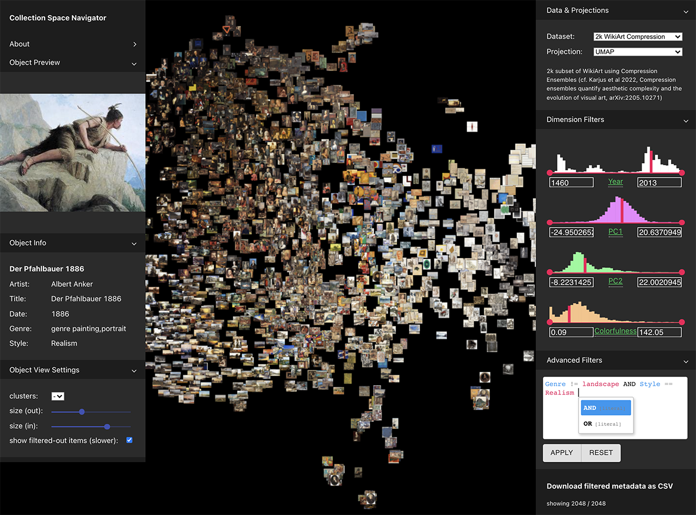

# CSN - Collection Space Navigator: 
Interactive Visualization Interface for Multidimensional Datasets

[Project Page: https://github.com/Collection-Space-Navigator/CSN](https://github.com/Collection-Space-Navigator/CSN)  

 

The Collection Space Navigator (CSN) is an explorative visualization tool for researching collections and their multidimensional representations. We designed this tool to better understand multidimensional data, its methods, and semantic qualities through spatial navigation and filtering. CSN can be used with any image collection and can be customized for specific research needs (see Jupyter Notebbok How-To guide).


## Demo

[-> WikiArt demo](https://collection-space-navigator.github.io/CSN)

## Getting Started

We recommend using the setup notebook (`CSN_setup.ipynb` [](https://colab.research.google.com/github/Collection-Space-Navigator/CSN/blob/main/CSN_setup.ipynb)) to prepare datasets and build a customized version of the Collection Space Navigator. 

## Using the Collection Space Navigator

Place your prepared dataset folders in the `build/datasets` directory and modify `build/datasets/datasets_config.json`. We recommend using the setup notebook `CSN_setup.ipynb` to format your data correctly.

To use the Collection Space Navigator locally run:
```
serve -s build
```
The CSN should be now accessible at `http://localhost:3000` in your browser.


## Development 
*For development only.*     

Important: `node 14.21.2` is required! We recommend using [NVM](https://github.com/nvm-sh/nvm) for node version managing:
```
nvm install v14.21.2
```
In the `CSN` directory, run:
```
npm install
```
To run the development server:
```
npm start
```   
Open [http://localhost:3000](http://localhost:3000) to view in your browser.

For production, run:
```
npm run build
```
It bundles React in production mode and optimizes the build for the best performance.    
    
The build is minified and the filenames include the hashes.    
Your app is ready to be deployed!    
    
See the section about [deployment](https://facebook.github.io/create-react-app/docs/deployment) for more information.

## Citation
```
@article{csn2022,
    author = {Ohm, Tillmann
              and Canet Sola, Mar
              and Karjus, Andres
              and Schich, Maximilian 
              },
    title = {Collection Space Navigator: Interactive Visualization Interface for Multidimensional Datasets},
    journal = {arXiv preprint arXiv:},
    year  = {2022}
}
```

## Authors

[Tillmann Ohm](https://tillmannohm.com/)  
[Mar Canet Solà](https://var-mar.info/)  

## Acknowledgements
Tillmann Ohm and Mar Canet Solà designed, co-authored, and developed the Collection Space Navigator (CSN) software. Tilmann Ohm, Mar Canet Solà, Anders Karjus, Maximilian Schich contributed to the broader research design, including initial applications of the CSN. The authors further thank the members of the CUDAN Research Group for useful discussions. All authors are supported by ERA Chair for [Cultural Data Analytics](https://cudan.tlu.ee/), funded through the European Union’s Horizon 2020 research and innovation program (Grant No.810961).
